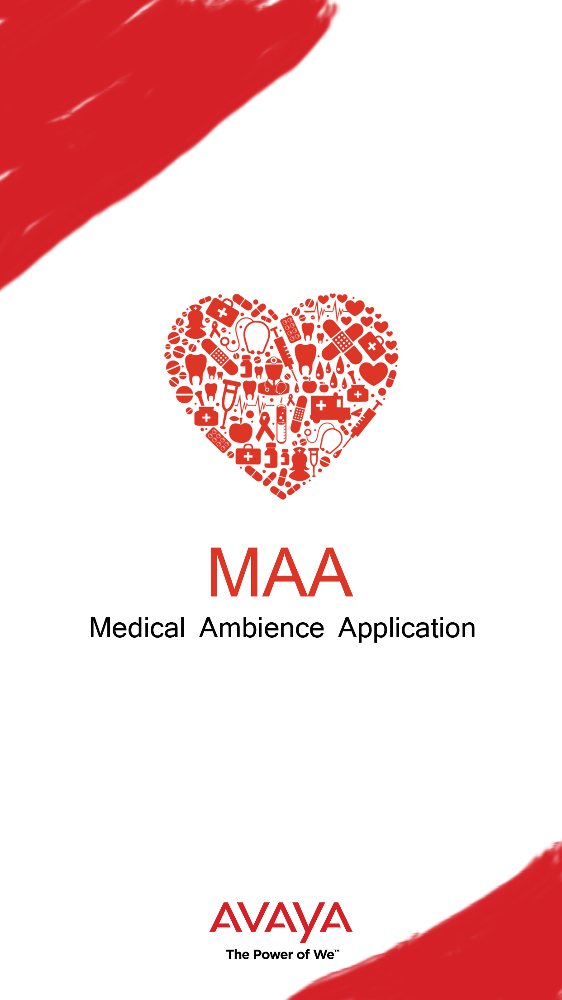

# MAA (Medical Ambience App)
### Digitisation is at its peak. Smart Centralised database will reduce the response time and shall drastically affect the medication process of critical disease.

### Android Application Restful API Health Score Data Analysis Communication over A/V Centralized Database

### We thought of doing AI feed by the vantage device, but couldn't integrate it successfully.

